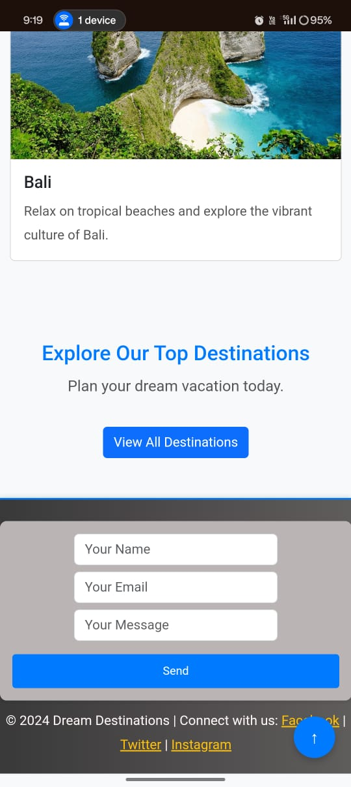
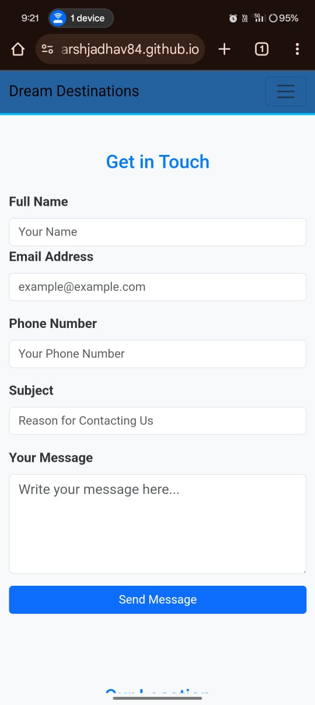

# Dream Destinations Travel Agency Website

## Description
A responsive, multi-page website for Dream Destinations Travel Agency, showcasing top travel destinations with advanced features like filtering, sorting, booking forms, and more. Built using **HTML**, **CSS**, **JavaScript**, and **Bootstrap**, this project demonstrates advanced frontend development skills.

## Features
- **Homepage**:
  - Hero carousel showcasing top destinations.
  - Navigation bar with links to all sections/pages.
  - "Top Destinations" section with cards.
  - Interactive footer with a contact form.
- **Destinations Page**:
  - List of destinations with filtering (by type) and sorting options (by popularity and budget).
- **Destination Details Page**:
  - Detailed information about a destination, including images, itineraries, and packages.
  - Modal-based booking form.
- **Booking Page**:
  - User-friendly booking form with real-time validation.
- **About Us Page**:
  - Company story, mission, and team details.
- **Contact Us Page**:
  - Detailed contact form with a placeholder for Google Maps.
- **Additional Features**:
  - Dynamic FAQ section with JavaScript accordions.
  - "Back to Top" button for easy navigation.

## Technologies Used
- **HTML5**
- **CSS3** with custom styling and animations.
- **JavaScript** for dynamic interactivity and form validation.
- **Bootstrap 5** for responsive design and UI components.

## How to View the Project
### Live Demo
Visit the live website here: [Dream Destinations Website](https://harshjadhav84.github.io/Dream-Destinations-Travel-Agency/)

## Local Setup
To run the project locally on your computer, follow these steps:

1. **Clone the Repository**:
   - Open your terminal or command prompt.
   - Clone this repository using the following command:
     ```bash
     git clone https://github.com/harshjadhav84/Dream-Destinations-Travel-Agency.git
     ```

2. **Navigate to the Project Directory**:
   - Change your working directory to the project folder:
     ```bash
     cd Dream-Destinations-Travel-Agency
     ```

3. **Open the Project in a Code Editor (Optional)**:
   - If you'd like to view or edit the code, open the project in your preferred code editor:
     ```bash
     code .  # For Visual Studio Code
     ```

4. **Run the Project**:
   - Open the `index.html` file in your web browser:
     - **Option 1**: Double-click the `index.html` file in your file explorer.
     - **Option 2**: Use the terminal:
       ```bash
       open index.html       # macOS
       start index.html      # Windows
       xdg-open index.html   # Linux
       ```

5. **Test the Features**:
   - Navigate through all the pages (e.g., Destinations, About Us, Contact Us) to explore the functionality.
  
## Screenshots

Here are the screenshots of the entire website showcasing its features and pages:








